# Tsubasa Fullstack Architecture Document

**Date:** 2025-10-24
**Version:** 1.0
**Author:** Winston (Architect)

---

## 1. Introduction

This document outlines the complete fullstack architecture for **Tsubasa**, including backend systems, frontend implementation, and their integration. It serves as the single source of truth for AI-driven development, ensuring consistency across the entire technology stack.

This unified approach combines what would traditionally be separate backend and frontend architecture documents, streamlining the development process for modern fullstack applications where these concerns are increasingly intertwined.

### Starter Template or Existing Project

**N/A - Greenfield Project**

This is a new Progressive Web Application built from scratch with Angular 17+ and Supabase. No starter templates are being used.

### Change Log

| Date | Version | Description | Author |
|------|---------|-------------|--------|
| 2025-10-24 | 1.0 | Initial architecture document created | Winston (Architect) |

---

## 2. High Level Architecture

### Technical Summary

Tsubasa is built as a **Jamstack-style Progressive Web Application** with an **offline-first, mobile-first architecture**. The frontend uses **Angular 17+** with Service Workers for offline capability, while the backend leverages **Supabase** (PostgreSQL + Auth + Realtime) as a Backend-as-a-Service. The application is deployed to **Cloudflare Pages** with global CDN distribution, ensuring fast load times for coaches accessing the app from remote field locations.

The architecture prioritizes **speed and reliability** over feature complexity. Direct RESTful API communication between Angular services and Supabase provides simplicity while Service Workers with IndexedDB enable full offline functionality—critical since many youth football fields lack reliable internet connectivity. Authentication uses Supabase Auth with Row-Level Security (RLS) policies ensuring complete data isolation between coaches. The PWA approach eliminates app store friction while maintaining a native-like experience through "Add to Home Screen" installation.

### Platform and Infrastructure Choice

**Platform:** Cloudflare Pages + Supabase
**Key Services:**
- **Frontend Hosting:** Cloudflare Pages (global CDN, automatic HTTPS)
- **Database:** Supabase PostgreSQL (with Row-Level Security)
- **Authentication:** Supabase Auth (email/password, JWT sessions)
- **Realtime (future):** Supabase Realtime subscriptions (v2 collaboration features)
- **Storage (future):** Supabase Storage (v2 photo uploads, exports)

**Deployment Host and Regions:**
- Cloudflare Pages: Global edge network (200+ cities)
- Supabase: Hosted in US East (free tier) or EU Central (compliance option)

### Repository Structure

**Structure:** Monolithic Single Application
**Monorepo Tool:** Not applicable (single Angular app in v1)
**Package Organization:** Standard Angular CLI structure with feature modules

### High Level Architecture Diagram

```mermaid
graph TB
    User[👤 Volunteer Coach<br/>Mobile Browser]

    subgraph "Client Side - PWA"
        PWA[Angular 17+ App<br/>Service Worker + IndexedDB]
        SW[Service Worker<br/>Offline Cache & Sync Queue]
    end

    subgraph "CDN Layer"
        CF[Cloudflare Pages<br/>Global Edge Network]
    end

    subgraph "Supabase Backend"
        Auth[Supabase Auth<br/>JWT Sessions]
        PGREST[PostgREST API<br/>Auto-generated REST]
        PG[(PostgreSQL<br/>with RLS)]
        RT[Realtime<br/>Subscriptions - v2]
    end

    subgraph "External Services - v1"
        GCal[Google Calendar API<br/>Optional Import]
    end

    User -->|HTTPS| PWA
    PWA -->|Static Assets| CF
    PWA <-->|Online: REST API| PGREST
    PWA <-->|Offline: Queue| SW
    SW -.->|Sync when online| PGREST
    PWA -->|Login/Signup| Auth
    Auth -->|Validate| PG
    PGREST <-->|RLS Queries| PG
    PWA -.->|Optional| GCal
```



### Architectural Patterns

- **Jamstack Architecture:** Static site generation with API-based backend - _Rationale:_ PWA with static Angular build served from CDN achieves maximum performance and offline capability
- **Offline-First Pattern:** Service Worker intercepts all requests; IndexedDB as local-first data store - _Rationale:_ Remote field locations have unreliable connectivity
- **Backend-as-a-Service (BaaS):** Supabase handles auth, database, and API generation - _Rationale:_ No custom backend code needed; accelerates MVP development
- **Row-Level Security (RLS):** Database-level access control via Supabase RLS policies - _Rationale:_ Each coach sees only their team data; security enforced at database layer
- **Component-Based UI:** Angular standalone components with reactive forms - _Rationale:_ Maintainability and reusability across feature modules
- **Repository Pattern (Data Layer):** Abstract Supabase API calls behind Angular services - _Rationale:_ Enables testing with mocks; provides migration path if backend changes
- **Optimistic UI Updates:** UI updates immediately, syncs in background - _Rationale:_ Essential for offline workflow; coaches see instant feedback
- **Queue-Based Sync:** Mutations queued during offline, replayed sequentially on reconnection - _Rationale:_ Maintains data consistency; handles partial failures gracefully

---

## 3. Tech Stack

This is the **DEFINITIVE** technology selection for the entire Tsubasa project. This table represents the single source of truth - all development must use these exact versions.

| Category | Technology | Version | Purpose | Rationale |
|----------|------------|---------|---------|-----------|
| Frontend Language | TypeScript | 5.2+ | Type-safe JavaScript for Angular app | Catches errors at compile time; required by Angular; improves maintainability |
| Frontend Framework | Angular | 17.3 LTS | Component-based SPA framework | LTS for stability; standalone components reduce boilerplate; excellent PWA support |
| UI Component Library | Angular Material | 17.3 | Material Design components | Consistent with Angular version; mobile-optimized; large touch targets for sideline use |
| State Management | RxJS + Signals | 7.8 / Angular 17+ | Reactive state and async operations | RxJS for async operations; Signals for simpler component state |
| Backend Language | SQL (PostgreSQL) | 14+ | Database queries via Supabase | No custom backend code needed; Supabase handles API generation |
| Backend Framework | Supabase (PostgREST) | 2.x | Auto-generated REST API from PostgreSQL | Zero backend code to maintain; automatic API from schema |
| API Style | REST | OpenAPI 3.0 | CRUD operations on resources | Supabase auto-generates RESTful endpoints; simpler than GraphQL for offline sync |
| Database | PostgreSQL | 14+ | Relational data storage | ACID compliance critical for stats accuracy; excellent JSON support; RLS for security |
| Cache | IndexedDB | Browser API | Offline data storage | Native browser storage for PWA offline mode; stores full dataset locally |
| File Storage | Supabase Storage | 2.x | Future: photos, exports (v2) | Same auth as database; S3-compatible |
| Authentication | Supabase Auth | 2.x | Email/password authentication | Integrated with database RLS; JWT sessions; handles password reset |
| Frontend Testing | Jasmine + Karma | 6.4 / 6.2 | Unit and component testing | Angular default; well-integrated |
| Backend Testing | pgTAP | 1.2+ | Database testing | Tests RLS policies and migrations |
| E2E Testing | Playwright | 1.40+ | Cross-browser E2E testing | Better than Cypress for PWA testing; handles Service Workers |
| Build Tool | Angular CLI | 17.3 | Development and build orchestration | Standard Angular tooling; handles PWA generation |
| Bundler | Webpack (via Angular) | 5.x | Module bundling and optimization | Handled by Angular CLI |
| IaC Tool | Supabase CLI | 1.x | Database migrations and RLS policies | Version control for database schema |
| CI/CD | GitHub Actions | N/A | Automated testing and deployment | Free for public repos; integrates with Cloudflare Pages |
| Monitoring | Sentry | 7.x | Error tracking and performance | Generous free tier; Angular SDK |
| Logging | Console + Sentry | N/A | Development and production logging | Console for dev; Sentry captures production errors |
| CSS Framework | Tailwind CSS | 3.4 | Utility-first CSS framework | Rapid prototyping; mobile-first utilities |

---

## 4. Data Models

### User (Coach)
**Purpose:** Represents a volunteer coach who manages a team. In v1, each coach has exactly one team (1:1 relationship).

**Key Attributes:**
- id: UUID - Unique identifier (Supabase Auth user ID)
- email: string - Login email address
- created_at: timestamp - Account creation date
- team_name: string - Name of the coach's team
- coach_name: string (optional) - Display name for the coach

**TypeScript Interface:**
```typescript
interface Coach {
  id: string;
  email: string;
  created_at: Date;
  team_name: string;
  coach_name?: string;
}
```

**Relationships:**
- Owns all team data (players, games, training sessions)

### Player
**Purpose:** Represents a youth football player on the coach's team. Minimal data for privacy.

**Key Attributes:**
- id: UUID - Unique identifier
- coach_id: UUID - Reference to owning coach (for RLS)
- first_name: string - Player's first name only
- last_initial: string - Last name initial (e.g., "R")
- display_name: string - Computed: "Max R."
- created_at: timestamp - When added to roster
- is_active: boolean - Soft delete for roster management

**TypeScript Interface:**
```typescript
interface Player {
  id: string;
  coach_id: string;
  first_name: string;
  last_initial: string;
  display_name?: string; // Computed: first_name + last_initial
  created_at: Date;
  is_active: boolean;
}
```

### Squad
**Purpose:** Grouping mechanism for players (e.g., "First Team", "U12 Blue").

**TypeScript Interface:**
```typescript
interface Squad {
  id: string;
  coach_id: string;
  name: string;
  color?: string; // Hex color for UI
  created_at: Date;
  is_active: boolean;
}
```

### TrainingSession
**Purpose:** Represents a practice/training event with attendance tracking.

**TypeScript Interface:**
```typescript
type TrainingStatus = 'scheduled' | 'completed' | 'cancelled';

interface TrainingSession {
  id: string;
  coach_id: string;
  date: Date;
  start_time: string; // "18:00"
  duration_minutes: number;
  location?: string;
  status: TrainingStatus;
  cancel_reason?: string;
  template_id?: string;
  notes?: string;
  created_at: Date;
}
```

### Attendance
**Purpose:** Tracks player attendance at training sessions. Three-state system.

**TypeScript Interface:**
```typescript
type AttendanceStatus = 'attended' | 'excused' | 'absent';

interface Attendance {
  id: string;
  coach_id: string;
  training_session_id: string;
  player_id: string;
  status: AttendanceStatus;
  marked_at: Date;
}
```

### Game
**Purpose:** Represents a match with opponent, tracking goals and timing.

**TypeScript Interface:**
```typescript
type GameStatus = 'scheduled' | 'in_progress' | 'completed' | 'cancelled';

interface Game {
  id: string;
  coach_id: string;
  date: Date;
  start_time?: string;
  opponent: string;
  location?: string;
  status: GameStatus;
  cancel_reason?: string;
  our_score: number;
  opponent_score: number;
  periods: number;
  period_minutes: number;
  current_period?: number;
  game_time_seconds?: number;
  notes?: string;
  created_at: Date;
}
```

### Goal
**Purpose:** Records a goal scored by our team with scorer, assists, and timing.

**TypeScript Interface:**
```typescript
interface Goal {
  id: string;
  coach_id: string;
  game_id: string;
  scorer_id?: string; // Null for own goals
  game_time_seconds: number;
  period: number;
  is_own_goal: boolean;
  created_at: Date;

  // Joined data (from queries)
  scorer?: Player;
  assists?: Player[];
}
```

---

## 5. API Specification

### REST API Specification (OpenAPI 3.0)

Key endpoints following RESTful nesting principles:

#### Games & Goals
- `GET /games` - List all games
- `POST /games` - Create new game
- `GET /games/{id}` - Get game details
- `PATCH /games/{id}` - Update game (live tracking)
- `GET /games/{id}/goals` - Get goals for a game
- `POST /games/{id}/goals` - Log goal with assists
- `PATCH /games/{game_id}/goals/{goal_id}` - Update goal
- `DELETE /games/{game_id}/goals/{goal_id}` - Delete goal (undo)
- `POST /games/{id}/opponent-goals` - Log opponent goal

#### Players
- `GET /players` - List all players
- `POST /players` - Create new player
- `PATCH /players/{id}` - Update player

#### Training & Attendance
- `GET /training_sessions` - List training sessions
- `POST /training_sessions` - Create training session
- `GET /training_sessions/{id}/attendances` - Get attendance
- `POST /training_sessions/{id}/attendances` - Bulk mark attendance

#### Statistics (RPC Functions)
- `POST /rpc/get_player_stats` - Get aggregated player statistics
- `POST /rpc/get_team_stats` - Get aggregated team statistics

### Authentication Headers
```http
Authorization: Bearer {supabase-jwt-token}
apikey: {supabase-anon-key}
Content-Type: application/json
```

### Offline Sync Strategy
1. Queue all POST/PATCH/DELETE operations in IndexedDB
2. Return optimistic responses to UI immediately
3. On reconnection, replay queue in order
4. Handle conflicts via "last write wins"
5. Retry failed operations with exponential backoff

---

## 6. Components

### Auth Service
**Responsibility:** Manages authentication flow, session state, and guards for protected routes.

**Key Interfaces:**
- `login(email, password): Observable<User>`
- `logout(): Observable<void>`
- `getCurrentUser(): Observable<User | null>`
- `isAuthenticated$: Observable<boolean>`

### Offline Sync Manager
**Responsibility:** Orchestrates offline data storage, sync queue management, and conflict resolution. Core component for PWA offline-first architecture.

**Key Interfaces:**
- `queueOperation(operation: SyncOperation): Promise<void>`
- `syncPendingOperations(): Observable<SyncResult[]>`
- `getOfflineStatus(): Observable<OfflineStatus>`

### Live Game Tracker Component
**Responsibility:** Real-time game tracking interface optimized for sideline use. Most critical component for user experience.

**Key Interfaces:**
- Game timer with period management
- Live scoreboard display
- Goal logging with player selection
- Assist selection (multi-select)
- Undo/edit controls
- Smart player sorting based on frequency

### Data Service Layer
**Responsibility:** Abstraction layer between Angular components and Supabase API. Handles caching, offline queue, and optimistic updates.

**Key Services:**
- `PlayerDataService`: CRUD for players
- `GameDataService`: Game management and goal tracking
- `TrainingDataService`: Sessions and attendance
- `StatsDataService`: Aggregated statistics calculations

---

## 7. External APIs

### Google Calendar API (Optional)
- **Purpose:** Import game and training schedules from existing Google Calendar
- **Authentication:** OAuth 2.0 with calendar.readonly scope
- **Integration Notes:** One-way sync only; protected completed games never overwritten

### iCalendar (.ics) File Import
- **Purpose:** Import schedules from any calendar system via standard .ics file format
- **Authentication:** None required - user uploads file
- **Integration Notes:** Client-side parsing with ical.js library; more privacy-friendly than OAuth

---

## 8. Core Workflows

Key system workflows include:

1. **User Authentication & Team Setup** - Sign up, create team, add players
2. **Offline Game Tracking** - Track game completely offline, sync when connected
3. **Training Session with Attendance** - Create from template, bulk mark attendance
4. **Live Goal Logging** - Smart sorting learns coach patterns for faster entry
5. **Post-Game Report & Sharing** - Screenshot-optimized report for WhatsApp sharing
6. **Error Recovery** - Graceful handling of auth expiry and sync conflicts

---

## 9. Database Schema

PostgreSQL schema with RLS policies for complete data isolation:

### Key Tables
- `coaches` - User profiles extending auth.users
- `players` - Team roster with minimal PII
- `squads` - Player groupings
- `training_sessions` - Practice events
- `attendances` - Three-state attendance tracking
- `games` - Match records
- `goals` - Our team's goals
- `goal_assists` - Many-to-many assists
- `opponent_goals` - Simple opponent scoring

### Security
- All tables have Row-Level Security (RLS) enabled
- Policies ensure `coach_id = auth.uid()` for complete isolation
- SECURITY DEFINER functions for elevated operations
- Comprehensive indexes on foreign keys and commonly filtered columns

---

## 10. Frontend Architecture

### Component Architecture
```text
src/app/
├── core/                    # Singleton services & guards
├── shared/                  # Reusable components
├── features/                # Feature modules (lazy loaded)
│   ├── auth/
│   ├── dashboard/
│   ├── players/
│   ├── training/
│   ├── games/
│   ├── live-game/
│   └── stats/
└── layouts/                 # Layout components
```

### State Management
- Signals for synchronous local state
- RxJS for async operations and service communication
- Service-based state management (no NgRx needed for single-user app)

### Routing Architecture
- Lazy-loaded feature modules
- Protected routes with functional guards
- Prevent accidental game exit with canDeactivate

---

## 11. Backend Architecture

Using Supabase Backend-as-a-Service:

### Database Functions
- Complex business logic in PostgreSQL functions
- Atomic operations (e.g., add_goal_with_assists)
- Bulk operations (e.g., bulk_update_attendance)
- Template-based generation (e.g., generate_training_sessions)

### Security Architecture
- Row Level Security (RLS) on all tables
- SECURITY DEFINER functions for controlled elevation
- auth.uid() ensures user context in all queries
- No application-level security logic needed

---

## 12. Unified Project Structure

### 12.1 High-Level Overview

```plaintext
tsubasa/
├── .github/workflows/       # CI/CD
├── src/                     # Angular application
│   ├── app/
│   │   ├── core/           # Services, guards
│   │   ├── shared/         # Reusable components
│   │   └── features/       # Feature modules
│   ├── assets/             # PWA icons, manifest
│   ├── environments/       # Config per environment
│   └── styles/             # Global styles
├── supabase/               # Database migrations
│   └── migrations/
├── tests/                  # E2E tests
├── docs/                   # Documentation
└── package.json
```

### 12.2 Complete Source Tree Structure

This is the **DEFINITIVE** directory structure for the Tsubasa project. All code must be organized according to this structure.

```
tsubasa/
├── .github/
│   └── workflows/
│       ├── ci.yml                          # CI pipeline (lint, test, build)
│       └── deploy.yml                      # CD to Cloudflare Pages
│
├── .vscode/
│   ├── extensions.json                     # Recommended VS Code extensions
│   ├── settings.json                       # Workspace settings
│   └── launch.json                         # Debug configurations
│
├── .bmad-core/                             # BMAD framework (if using)
│   ├── core-config.yaml
│   ├── tasks/
│   ├── templates/
│   └── checklists/
│
├── docs/
│   ├── architecture.md                     # This document
│   ├── prd.md                              # Product requirements
│   ├── stories/                            # User stories
│   └── api/
│       └── supabase-schema.md              # Database schema reference
│
├── supabase/
│   ├── config.toml                         # Supabase project config
│   ├── .gitignore
│   ├── migrations/
│   │   ├── 20250101000001_init_schema.sql
│   │   ├── 20250101000002_teams_players.sql
│   │   ├── 20250101000003_games_goals.sql
│   │   ├── 20250101000004_training_sessions.sql
│   │   ├── 20250101000005_rls_policies.sql
│   │   └── 20250101000006_indexes.sql
│   ├── functions/
│   │   ├── get-player-stats/
│   │   │   └── index.ts                    # RPC: Player stats aggregation
│   │   ├── get-team-stats/
│   │   │   └── index.ts                    # RPC: Team stats aggregation
│   │   └── bulk-update-attendance/
│   │       └── index.ts                    # RPC: Bulk attendance operations
│   └── seed.sql                            # Test data for local development
│
├── src/
│   ├── app/
│   │   ├── app.component.ts                # Root component
│   │   ├── app.component.html
│   │   ├── app.component.scss
│   │   ├── app.config.ts                   # Application configuration (providers)
│   │   ├── app.routes.ts                   # Root route definitions
│   │   │
│   │   ├── core/                           # Singleton services, guards, interceptors
│   │   │   ├── auth/
│   │   │   │   ├── auth.service.ts         # Supabase auth wrapper
│   │   │   │   ├── auth.guard.ts           # Route protection
│   │   │   │   └── auth.interceptor.ts     # JWT injection
│   │   │   ├── sync/
│   │   │   │   ├── sync-queue.service.ts   # Offline operation queue
│   │   │   │   ├── sync-manager.service.ts # Background sync orchestrator
│   │   │   │   └── conflict-resolver.service.ts # Conflict resolution
│   │   │   ├── storage/
│   │   │   │   ├── indexed-db.service.ts   # Dexie.js wrapper
│   │   │   │   └── db-schema.ts            # IndexedDB schema definition
│   │   │   ├── network/
│   │   │   │   ├── network-status.service.ts   # Online/offline detection
│   │   │   │   └── network.interceptor.ts      # Queue offline requests
│   │   │   └── supabase/
│   │   │       └── supabase.service.ts     # Supabase client wrapper
│   │   │
│   │   ├── shared/                         # Reusable components, pipes, directives
│   │   │   ├── components/
│   │   │   │   ├── header/
│   │   │   │   │   ├── header.component.ts
│   │   │   │   │   ├── header.component.html
│   │   │   │   │   └── header.component.scss
│   │   │   │   ├── bottom-nav/
│   │   │   │   │   ├── bottom-nav.component.ts
│   │   │   │   │   ├── bottom-nav.component.html
│   │   │   │   │   └── bottom-nav.component.scss
│   │   │   │   ├── player-avatar/
│   │   │   │   │   ├── player-avatar.component.ts
│   │   │   │   │   ├── player-avatar.component.html
│   │   │   │   │   └── player-avatar.component.scss
│   │   │   │   ├── loading-spinner/
│   │   │   │   │   ├── loading-spinner.component.ts
│   │   │   │   │   └── loading-spinner.component.html
│   │   │   │   ├── empty-state/
│   │   │   │   │   ├── empty-state.component.ts
│   │   │   │   │   └── empty-state.component.html
│   │   │   │   └── confirmation-dialog/
│   │   │   │       ├── confirmation-dialog.component.ts
│   │   │   │       └── confirmation-dialog.component.html
│   │   │   ├── pipes/
│   │   │   │   ├── time-format.pipe.ts     # Format game time (seconds → "45'")
│   │   │   │   ├── player-name.pipe.ts     # Format player display name
│   │   │   │   └── date-format.pipe.ts     # Localized date formatting
│   │   │   └── directives/
│   │   │       ├── long-press.directive.ts # Touch gesture for mobile
│   │   │       └── swipe-action.directive.ts # Swipe to delete/edit
│   │   │
│   │   ├── features/                       # Feature modules (lazy-loaded)
│   │   │   │
│   │   │   ├── auth/
│   │   │   │   ├── pages/
│   │   │   │   │   ├── login/
│   │   │   │   │   │   ├── login.component.ts
│   │   │   │   │   │   ├── login.component.html
│   │   │   │   │   │   └── login.component.scss
│   │   │   │   │   ├── register/
│   │   │   │   │   │   ├── register.component.ts
│   │   │   │   │   │   ├── register.component.html
│   │   │   │   │   │   └── register.component.scss
│   │   │   │   │   ├── team-setup/
│   │   │   │   │   │   ├── team-setup.component.ts
│   │   │   │   │   │   ├── team-setup.component.html
│   │   │   │   │   │   └── team-setup.component.scss
│   │   │   │   │   └── password-reset/
│   │   │   │   │       ├── password-reset.component.ts
│   │   │   │   │       └── password-reset.component.html
│   │   │   │   └── auth.routes.ts
│   │   │   │
│   │   │   ├── dashboard/
│   │   │   │   ├── pages/
│   │   │   │   │   └── home/
│   │   │   │   │       ├── home.component.ts
│   │   │   │   │       ├── home.component.html
│   │   │   │   │       └── home.component.scss
│   │   │   │   ├── components/
│   │   │   │   │   ├── quick-stats-card/
│   │   │   │   │   │   ├── quick-stats-card.component.ts
│   │   │   │   │   │   ├── quick-stats-card.component.html
│   │   │   │   │   │   └── quick-stats-card.component.scss
│   │   │   │   │   ├── upcoming-games-widget/
│   │   │   │   │   │   ├── upcoming-games-widget.component.ts
│   │   │   │   │   │   ├── upcoming-games-widget.component.html
│   │   │   │   │   │   └── upcoming-games-widget.component.scss
│   │   │   │   │   └── recent-training-widget/
│   │   │   │   │       └── recent-training-widget.component.ts
│   │   │   │   └── dashboard.routes.ts
│   │   │   │
│   │   │   ├── players/
│   │   │   │   ├── pages/
│   │   │   │   │   ├── player-list/
│   │   │   │   │   │   ├── player-list.component.ts
│   │   │   │   │   │   ├── player-list.component.html
│   │   │   │   │   │   └── player-list.component.scss
│   │   │   │   │   ├── player-detail/
│   │   │   │   │   │   ├── player-detail.component.ts
│   │   │   │   │   │   ├── player-detail.component.html
│   │   │   │   │   │   └── player-detail.component.scss
│   │   │   │   │   └── player-form/
│   │   │   │   │       ├── player-form.component.ts
│   │   │   │   │       ├── player-form.component.html
│   │   │   │   │       └── player-form.component.scss
│   │   │   │   ├── components/
│   │   │   │   │   ├── player-card/
│   │   │   │   │   │   ├── player-card.component.ts
│   │   │   │   │   │   ├── player-card.component.html
│   │   │   │   │   │   └── player-card.component.scss
│   │   │   │   │   └── squad-selector/
│   │   │   │   │       ├── squad-selector.component.ts
│   │   │   │   │       └── squad-selector.component.html
│   │   │   │   ├── services/
│   │   │   │   │   └── player.service.ts
│   │   │   │   └── players.routes.ts
│   │   │   │
│   │   │   ├── games/
│   │   │   │   ├── pages/
│   │   │   │   │   ├── game-list/
│   │   │   │   │   │   ├── game-list.component.ts
│   │   │   │   │   │   ├── game-list.component.html
│   │   │   │   │   │   └── game-list.component.scss
│   │   │   │   │   ├── game-form/
│   │   │   │   │   │   ├── game-form.component.ts
│   │   │   │   │   │   ├── game-form.component.html
│   │   │   │   │   │   └── game-form.component.scss
│   │   │   │   │   ├── game-detail/
│   │   │   │   │   │   ├── game-detail.component.ts
│   │   │   │   │   │   ├── game-detail.component.html
│   │   │   │   │   │   └── game-detail.component.scss
│   │   │   │   │   └── live-game/
│   │   │   │   │       ├── live-game.component.ts     # Live game tracking UI
│   │   │   │   │       ├── live-game.component.html
│   │   │   │   │       └── live-game.component.scss
│   │   │   │   ├── components/
│   │   │   │   │   ├── game-card/
│   │   │   │   │   │   ├── game-card.component.ts
│   │   │   │   │   │   ├── game-card.component.html
│   │   │   │   │   │   └── game-card.component.scss
│   │   │   │   │   ├── live-scoreboard/
│   │   │   │   │   │   ├── live-scoreboard.component.ts    # Sticky header with live score
│   │   │   │   │   │   ├── live-scoreboard.component.html
│   │   │   │   │   │   └── live-scoreboard.component.scss
│   │   │   │   │   ├── goal-logger/
│   │   │   │   │   │   ├── goal-logger.component.ts        # <5 second goal logging
│   │   │   │   │   │   ├── goal-logger.component.html
│   │   │   │   │   │   └── goal-logger.component.scss
│   │   │   │   │   ├── game-timeline/
│   │   │   │   │   │   ├── game-timeline.component.ts      # Event history
│   │   │   │   │   │   ├── game-timeline.component.html
│   │   │   │   │   │   └── game-timeline.component.scss
│   │   │   │   │   ├── game-timer/
│   │   │   │   │   │   ├── game-timer.component.ts         # Web Worker timer display
│   │   │   │   │   │   ├── game-timer.component.html
│   │   │   │   │   │   └── game-timer.component.scss
│   │   │   │   │   └── calendar-import/
│   │   │   │   │       ├── calendar-import.component.ts     # iCal + Google Calendar
│   │   │   │   │       └── calendar-import.component.html
│   │   │   │   ├── services/
│   │   │   │   │   ├── game.service.ts
│   │   │   │   │   ├── goal.service.ts
│   │   │   │   │   ├── game-timer.service.ts               # Web Worker manager
│   │   │   │   │   └── calendar-import.service.ts          # Calendar integration
│   │   │   │   └── games.routes.ts
│   │   │   │
│   │   │   ├── training/
│   │   │   │   ├── pages/
│   │   │   │   │   ├── training-list/
│   │   │   │   │   │   ├── training-list.component.ts
│   │   │   │   │   │   ├── training-list.component.html
│   │   │   │   │   │   └── training-list.component.scss
│   │   │   │   │   ├── training-detail/
│   │   │   │   │   │   ├── training-detail.component.ts
│   │   │   │   │   │   ├── training-detail.component.html
│   │   │   │   │   │   └── training-detail.component.scss
│   │   │   │   │   └── training-form/
│   │   │   │   │       ├── training-form.component.ts
│   │   │   │   │       ├── training-form.component.html
│   │   │   │   │       └── training-form.component.scss
│   │   │   │   ├── components/
│   │   │   │   │   ├── training-card/
│   │   │   │   │   │   ├── training-card.component.ts
│   │   │   │   │   │   ├── training-card.component.html
│   │   │   │   │   │   └── training-card.component.scss
│   │   │   │   │   ├── attendance-tracker/
│   │   │   │   │   │   ├── attendance-tracker.component.ts  # 3-state attendance
│   │   │   │   │   │   ├── attendance-tracker.component.html
│   │   │   │   │   │   └── attendance-tracker.component.scss
│   │   │   │   │   └── template-selector/
│   │   │   │   │       ├── template-selector.component.ts
│   │   │   │   │       └── template-selector.component.html
│   │   │   │   ├── services/
│   │   │   │   │   ├── training.service.ts
│   │   │   │   │   └── attendance.service.ts
│   │   │   │   └── training.routes.ts
│   │   │   │
│   │   │   └── statistics/
│   │   │       ├── pages/
│   │   │       │   ├── stats-dashboard/
│   │   │       │   │   ├── stats-dashboard.component.ts
│   │   │       │   │   ├── stats-dashboard.component.html
│   │   │       │   │   └── stats-dashboard.component.scss
│   │   │       │   ├── player-stats/
│   │   │       │   │   ├── player-stats.component.ts
│   │   │       │   │   ├── player-stats.component.html
│   │   │       │   │   └── player-stats.component.scss
│   │   │       │   └── post-game-report/
│   │   │       │       ├── post-game-report.component.ts
│   │   │       │       ├── post-game-report.component.html
│   │   │       │       └── post-game-report.component.scss
│   │   │       ├── components/
│   │   │       │   ├── stat-card/
│   │   │       │   │   ├── stat-card.component.ts
│   │   │       │   │   ├── stat-card.component.html
│   │   │       │   │   └── stat-card.component.scss
│   │   │       │   └── chart-wrapper/
│   │   │       │       ├── chart-wrapper.component.ts
│   │   │       │       └── chart-wrapper.component.html
│   │   │       ├── services/
│   │   │       │   └── statistics.service.ts
│   │   │       └── statistics.routes.ts
│   │   │
│   │   └── models/                         # TypeScript interfaces + types
│   │       ├── player.model.ts
│   │       ├── game.model.ts
│   │       ├── goal.model.ts
│   │       ├── training.model.ts
│   │       ├── attendance.model.ts
│   │       ├── squad.model.ts
│   │       ├── team.model.ts
│   │       ├── sync-operation.model.ts
│   │       └── supabase.types.ts           # Auto-generated from Supabase CLI
│   │
│   ├── assets/
│   │   ├── icons/
│   │   │   ├── icon-72x72.png              # PWA icons (multiple sizes)
│   │   │   ├── icon-96x96.png
│   │   │   ├── icon-128x128.png
│   │   │   ├── icon-144x144.png
│   │   │   ├── icon-152x152.png
│   │   │   ├── icon-192x192.png
│   │   │   ├── icon-384x384.png
│   │   │   └── icon-512x512.png
│   │   ├── images/
│   │   │   ├── logo.svg
│   │   │   ├── logo-white.svg
│   │   │   └── placeholder-avatar.svg
│   │   └── i18n/                           # (Future) Internationalization
│   │       └── en.json
│   │
│   ├── environments/
│   │   ├── environment.ts                  # Development config
│   │   ├── environment.staging.ts          # Staging config
│   │   └── environment.prod.ts             # Production config
│   │
│   ├── styles/
│   │   ├── _variables.scss                 # SCSS variables (colors, spacing)
│   │   ├── _mixins.scss                    # SCSS mixins
│   │   ├── _typography.scss                # Font definitions
│   │   ├── _material-overrides.scss        # Angular Material theme overrides
│   │   └── styles.scss                     # Global styles + Tailwind imports
│   │
│   ├── workers/
│   │   └── game-timer.worker.ts            # Web Worker for background game timer
│   │
│   ├── index.html                          # HTML entry point
│   ├── main.ts                             # Angular bootstrap
│   ├── manifest.webmanifest                # PWA manifest
│   ├── ngsw-config.json                    # Service Worker config
│   └── polyfills.ts                        # Browser polyfills (if needed)
│
├── tests/
│   ├── e2e/                                # Playwright E2E tests
│   │   ├── auth.spec.ts
│   │   ├── goal-logging.spec.ts
│   │   ├── offline-sync.spec.ts
│   │   └── player-management.spec.ts
│   └── playwright.config.ts
│
├── .editorconfig                           # Editor settings
├── .eslintrc.json                          # ESLint rules
├── .gitignore
├── .prettierrc                             # Prettier formatting
├── angular.json                            # Angular CLI config
├── karma.conf.js                           # Karma test runner config
├── package.json
├── package-lock.json
├── README.md
├── tailwind.config.js                      # Tailwind CSS config
├── tsconfig.json                           # TypeScript base config
├── tsconfig.app.json                       # App-specific TS config
└── tsconfig.spec.json                      # Test-specific TS config
```

### 12.3 Key Directory Purposes

#### `/src/app/core/`
**Purpose:** Singleton services that are instantiated once and used throughout the application.

**Rules:**
- Services are provided in root (`providedIn: 'root'`)
- Guards and interceptors live here
- Never import feature modules into core

#### `/src/app/shared/`
**Purpose:** Reusable, stateless components, pipes, and directives used across multiple features.

**Rules:**
- Components should be presentational (dumb components)
- No business logic or API calls
- Should be highly reusable

#### `/src/app/features/`
**Purpose:** Feature modules organized by domain. Each feature is lazy-loaded.

**Rules:**
- Each feature has its own routes file
- Services can be feature-scoped or provided in root
- Pages are routable components, components are reusable within the feature

#### `/src/app/models/`
**Purpose:** TypeScript interfaces and types shared across the application.

**Rules:**
- Define once, use everywhere (DRY principle)
- Match database schema for consistency
- Use `supabase.types.ts` as single source of truth for database types

#### `/supabase/migrations/`
**Purpose:** Version-controlled database schema changes.

**Rules:**
- Migrations are immutable (never edit existing migrations)
- Use timestamp-based naming: `YYYYMMDDHHMMSS_description.sql`
- Always test migrations locally before production

### 12.4 File Naming Conventions

| Type | Pattern | Example |
|------|---------|---------|
| Component | `*.component.ts` | `player-list.component.ts` |
| Service | `*.service.ts` | `auth.service.ts` |
| Guard | `*.guard.ts` | `auth.guard.ts` |
| Interceptor | `*.interceptor.ts` | `network.interceptor.ts` |
| Pipe | `*.pipe.ts` | `time-format.pipe.ts` |
| Directive | `*.directive.ts` | `long-press.directive.ts` |
| Model | `*.model.ts` | `player.model.ts` |
| Routes | `*.routes.ts` | `games.routes.ts` |
| Spec (Test) | `*.spec.ts` | `player.service.spec.ts` |

### 12.5 Import Path Conventions

Use TypeScript path mapping for cleaner imports:

```typescript
// tsconfig.json
{
  "compilerOptions": {
    "paths": {
      "@core/*": ["src/app/core/*"],
      "@shared/*": ["src/app/shared/*"],
      "@features/*": ["src/app/features/*"],
      "@models/*": ["src/app/models/*"],
      "@environments/*": ["src/environments/*"]
    }
  }
}
```

**Example Usage:**
```typescript
import { AuthService } from '@core/auth/auth.service';
import { PlayerService } from '@features/players/services/player.service';
import { Player } from '@models/player.model';
```

---

## 13. Development Workflow

### Local Setup
```bash
# Prerequisites: Node 18+, Angular CLI 17, Supabase CLI

# Clone and install
git clone https://github.com/your-org/tsubasa.git
cd tsubasa
npm install

# Start Supabase locally
supabase start

# Run migrations
supabase db push

# Start dev server
npm start
```

### Key Commands
- `npm start` - Start frontend dev server
- `npm test` - Run unit tests
- `npm run e2e` - Run E2E tests
- `npm run build` - Production build
- `npm run supabase:types` - Generate TypeScript types

---

## 14. Deployment Architecture

### Deployment Strategy
- **Frontend:** Cloudflare Pages (global CDN)
- **Backend:** Supabase Cloud (managed PostgreSQL)
- **CI/CD:** GitHub Actions for automated deployment

### Environments
| Environment | Frontend URL | Backend URL |
|------------|--------------|-------------|
| Development | http://localhost:4200 | http://localhost:54321 |
| Staging | https://staging.tsubasa.pages.dev | https://staging-project.supabase.co |
| Production | https://tsubasa.app | https://prod-project.supabase.co |

### Cost Optimization
- **MVP (50 coaches):** $0/month (free tiers)
- **Growth (500 coaches):** $25/month
- **Scale (5000 coaches):** $125/month

---

## 15. Security and Performance

### Security Requirements

**Frontend Security:**
- CSP headers configured
- Angular's built-in XSS protection
- JWT tokens in memory only

**Backend Security:**
- Database constraints validation
- Supabase rate limiting (100 req/s)
- RLS policies for data isolation

**Authentication Security:**
- 1-hour access tokens with refresh
- Bcrypt password hashing
- Email-based password reset

### Performance Optimization

**Frontend Performance:**
- Bundle size < 250KB (initial)
- Lazy loading all features
- Service Worker caching
- OnPush change detection

**Backend Performance:**
- Response time < 200ms (p95)
- Indexed foreign keys
- Connection pooling
- Query optimization

---

## 16. Testing Strategy

### Testing Pyramid
- E2E Tests (10%)
- Integration Tests (30%)
- Unit Tests (60%)

### Test Coverage Requirements
- Statements: 80%
- Branches: 75%
- Functions: 80%
- Lines: 80%

### Key Test Areas
- Offline sync scenarios
- RLS policy verification
- Game tracking workflows
- PWA functionality

---

## 17. Coding Standards

### Critical Rules
- **Type Sharing:** Define types in core/models, never duplicate
- **API Calls:** Always use service layer, never direct HTTP
- **State Updates:** Use Signals .update() or .set()
- **Offline Queue:** All mutations through OfflineSyncService
- **Auth Checks:** Use RLS policies, not application code

### Naming Conventions
- Components: PascalCase
- Services: PascalCase + "Service"
- Database: snake_case
- API Routes: kebab-case
- Constants: UPPER_SNAKE_CASE

---

## 18. Error Handling Strategy

### Error Flow
- Frontend normalizes all errors to AppError
- Service layer handles retry logic
- UI shows user-friendly messages
- Offline errors queue for sync

### Error Response Format
```typescript
interface ApiError {
  error: {
    code: string;
    message: string;
    details?: Record<string, any>;
    timestamp: string;
    requestId: string;
  };
}
```

### Recovery Strategies
- Circuit breaker for service failures
- Exponential backoff for retries
- Fallback to cached data
- Graceful degradation

---

## 19. Monitoring and Observability

### Monitoring Stack
- **Frontend:** Sentry + Web Vitals
- **Backend:** Supabase metrics
- **Errors:** Unified Sentry tracking
- **Performance:** Lighthouse CI

### Key Metrics

**Frontend:**
- Core Web Vitals (LCP < 2.5s, FID < 100ms, CLS < 0.1)
- JavaScript error rate < 1%
- Offline sync success rate > 95%

**Backend:**
- Request rate and error rate
- Response time percentiles
- Database query performance
- RLS policy violations

### Alerting Rules
- High error rate (>5%) - Critical
- Slow API response (p95 > 1s) - Warning
- Sync failures (>10%) - Warning
- Low cache hit ratio (<90%) - Info

---

## Conclusion

This architecture provides a robust foundation for the Tsubasa PWA, prioritizing:
- **Offline-first** operation for remote fields
- **Mobile-optimized** UX for sideline use
- **Privacy-first** data handling for youth players
- **Cost-effective** infrastructure scaling
- **Developer-friendly** patterns and tooling

The architecture is designed to evolve from MVP to full-featured platform while maintaining simplicity and performance at every stage.