# 2. High Level Architecture

## Technical Summary

Tsubasa is built as a **Jamstack-style Progressive Web Application** with an **offline-first, mobile-first architecture**. The frontend uses **Angular 17+** with Service Workers for offline capability, while the backend leverages **Supabase** (PostgreSQL + Auth + Realtime) as a Backend-as-a-Service. The application is deployed to **Cloudflare Pages** with global CDN distribution, ensuring fast load times for coaches accessing the app from remote field locations.

The architecture prioritizes **speed and reliability** over feature complexity. Direct RESTful API communication between Angular services and Supabase provides simplicity while Service Workers with IndexedDB enable full offline functionality—critical since many youth football fields lack reliable internet connectivity. Authentication uses Supabase Auth with Row-Level Security (RLS) policies ensuring complete data isolation between coaches. The PWA approach eliminates app store friction while maintaining a native-like experience through "Add to Home Screen" installation.

## Platform and Infrastructure Choice

**Platform:** Cloudflare Pages + Supabase
**Key Services:**
- **Frontend Hosting:** Cloudflare Pages (global CDN, automatic HTTPS)
- **Database:** Supabase PostgreSQL (with Row-Level Security)
- **Authentication:** Supabase Auth (email/password, JWT sessions)
- **Realtime (future):** Supabase Realtime subscriptions (v2 collaboration features)
- **Storage (future):** Supabase Storage (v2 photo uploads, exports)

**Deployment Host and Regions:**
- Cloudflare Pages: Global edge network (200+ cities)
- Supabase: Hosted in US East (free tier) or EU Central (compliance option)

## Repository Structure

**Structure:** Monolithic Single Application
**Monorepo Tool:** Not applicable (single Angular app in v1)
**Package Organization:** Standard Angular CLI structure with feature modules

## High Level Architecture Diagram

```mermaid
graph TB
    User[👤 Volunteer Coach<br/>Mobile Browser]

    subgraph "Client Side - PWA"
        PWA[Angular 17+ App<br/>Service Worker + IndexedDB]
        SW[Service Worker<br/>Offline Cache & Sync Queue]
    end

    subgraph "CDN Layer"
        CF[Cloudflare Pages<br/>Global Edge Network]
    end

    subgraph "Supabase Backend"
        Auth[Supabase Auth<br/>JWT Sessions]
        PGREST[PostgREST API<br/>Auto-generated REST]
        PG[(PostgreSQL<br/>with RLS)]
        RT[Realtime<br/>Subscriptions - v2]
    end

    subgraph "External Services - v1"
        GCal[Google Calendar API<br/>Optional Import]
    end

    User -->|HTTPS| PWA
    PWA -->|Static Assets| CF
    PWA <-->|Online: REST API| PGREST
    PWA <-->|Offline: Queue| SW
    SW -.->|Sync when online| PGREST
    PWA -->|Login/Signup| Auth
    Auth -->|Validate| PG
    PGREST <-->|RLS Queries| PG
    PWA -.->|Optional| GCal
```

## Architectural Patterns

- **Jamstack Architecture:** Static site generation with API-based backend - _Rationale:_ PWA with static Angular build served from CDN achieves maximum performance and offline capability
- **Offline-First Pattern:** Service Worker intercepts all requests; IndexedDB as local-first data store - _Rationale:_ Remote field locations have unreliable connectivity
- **Backend-as-a-Service (BaaS):** Supabase handles auth, database, and API generation - _Rationale:_ No custom backend code needed; accelerates MVP development
- **Row-Level Security (RLS):** Database-level access control via Supabase RLS policies - _Rationale:_ Each coach sees only their team data; security enforced at database layer
- **Component-Based UI:** Angular standalone components with reactive forms - _Rationale:_ Maintainability and reusability across feature modules
- **Repository Pattern (Data Layer):** Abstract Supabase API calls behind Angular services - _Rationale:_ Enables testing with mocks; provides migration path if backend changes
- **Optimistic UI Updates:** UI updates immediately, syncs in background - _Rationale:_ Essential for offline workflow; coaches see instant feedback
- **Queue-Based Sync:** Mutations queued during offline, replayed sequentially on reconnection - _Rationale:_ Maintains data consistency; handles partial failures gracefully

---
